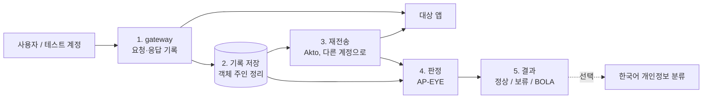

# BOLA 판정 구조 제안

작성일: 2026-10-06. 관련 이슈: #7. 팀 검토 전 초안이다.

## 관점

**내부(운영자) 관점으로 정한다.** 서비스 운영자가 자기 앱 앞에 gateway를 두고, 자기 테스트 계정으로 BOLA를 검사한다.

| 관점 | 누가 돌리나 | 무엇을 보나 | 이번 범위 |
|---|---|---|---|
| 내부 (운영자) | 서비스 운영자가 자기 앱에 | 실제 트래픽과 테스트 계정 | 포함 |
| 외부 (공격자) | 바깥 사람이 남의 앱에 | API 응답만 | 제외 |

"다른 계정으로 다시 보내기"도 운영자가 자기 테스트 계정으로 하는 검사라서 내부 관점에 속한다. Akto도 같은 구조다. 외부 공격자 관점 스캐너(예: AuthzTrace)는 이번 범위에서 뺀다.

## 결론

**gateway가 트래픽을 모으고, 별도 검사 도구가 판정한다.**

- gateway: 앱 앞에서 요청과 응답을 기록한다. 어떤 계정이 어떤 객체를 만들고 봤는지 정리한다. 우리가 직접 만든다.
- 검사 도구: 기록된 요청을 다른 계정으로 다시 보내고, 응답을 보고 정상 / 보류 / BOLA를 정한다. 재전송은 Akto를 쓰고 판정은 우리가 만든다.

gateway에서 바로 판정하지 않는 이유는 하나다. 실제 사용자 요청만 봐서는 "B는 이 객체를 보면 안 된다"는 근거가 없다. 그 근거는 테스트 계정으로 직접 다시 보내 봐야 나온다.

## 전체 흐름

| 단계 | 누가 | 입력 | 출력 |
|---|---|---|---|
| 1. 기록 | gateway (직접 구현) | 앱으로 가는 요청과 응답 | 요청·응답 기록 |
| 2. 객체 주인 정리 | gateway (직접 구현) | 1단계 기록 | 객체 목록: 객체 ID, 만든 계정, 공개 범위 |
| 3. 재전송 | Akto | 기록된 요청, 다른 계정의 인증 정보 | 다른 계정으로 보낸 요청의 응답 |
| 4. 판정 | AP-EYE | 2단계 객체 목록, 3단계 응답 | 판정과 근거 |
| 5. 결과 | AP-EYE | 판정 | 보고서. BOLA면 노출된 정보 종류도 표시 |

## gateway가 하는 일

1. **요청과 응답을 그대로 앱에 전달한다.** 기록이 실패해도 앱 요청은 막지 않는다.
2. **기록한다.** 시간, 계정(인증 토큰에서 추출), 메서드, 경로, 상태 코드, 요청·응답 본문을 남긴다.
3. **객체 주인을 정리한다.** 예: 계정 A의 `POST /plan` 응답에 `id: 12`가 있으면 "12번은 A가 만든 객체"로 적는다.
4. **Akto에 넘긴다.** Akto가 읽을 수 있는 형식으로 내보낸다. 형식은 TBD(Akto가 지원하는 입력 방식 확인 필요).

공개 범위는 트래픽만으로 알 수 없는 경우가 있다. 이럴 때는 테스트 계정으로 객체를 만들 때 사람이 직접 적거나, 모르면 보류로 둔다.

## 판정 규칙

| 상황 | 판정 |
|---|---|
| B가 볼 수 없는 객체인데 응답에 그 객체가 들어 있다 | BOLA |
| B가 볼 수 없는 객체이고 응답에서 차단됐다(401, 403, 빈 목록) | 정상 |
| 공개 객체거나 B와 공유된 객체가 응답에 들어 있다 | 정상 |
| 객체의 공개 범위를 모르거나, 응답에서 요청한 객체를 찾을 수 없다 | 보류 |

- 응답이 200이라는 것만으로는 BOLA로 판정하지 않는다.
- 응답에 개인정보가 있다는 것만으로도 BOLA로 판정하지 않는다.
- 응답에 객체가 있는지는 객체 ID나 테스트용 고유 문구로 확인한다.
- 목록 응답은 객체 하나씩 따로 판정한다. 목록 안에 B가 볼 수 없는 객체가 하나라도 있으면 BOLA다.

## 예시: wger

1. 계정 A가 gateway를 거쳐 비공개 식단을 만든다. gateway는 "식단 12번, 주인 A, 비공개"로 기록한다.
2. Akto가 A의 식단 조회 요청을 계정 B의 인증 정보로 다시 보낸다.
3. 판정한다.
   - 문제가 있는 버전에서는 A의 식단이 반환되므로 BOLA다.
   - 수정된 버전에서는 차단되거나 목록에서 빠지므로 정상이다.
   - 공개 운동 계획은 B가 봐도 정상이다.

## 누가 무엇을 만드나

| 일 | 담당 |
|---|---|
| 트래픽 기록, 객체 주인 정리 | AP-EYE gateway (직접 구현) |
| API 목록 생성, 계정 바꿔 재전송 (Test Role) | Akto 기존 기능 |
| 객체 단위 판정 (정상 / 보류 / BOLA) | AP-EYE 추가 |
| 한국어 개인정보 분류 | Akto 기존 설정 우선 확인, 부족한 부분만 추가 |

Akto는 지금 "원래 응답과 90% 이상 비슷한가"로 판정한다([조사 문서](../docs/akto/2026-10-04-akto-deep-analysis.md)). 그래서 공개 객체를 BOLA로 잘못 보거나, 목록에 섞인 남의 객체를 놓칠 수 있다. 4단계가 이 부분을 대신한다.

## 아직 정할 것

1. gateway를 무엇으로 만들지(예: mitmproxy 스크립트, 직접 만든 리버스 프록시).
2. gateway 기록을 Akto에 넘기는 형식.
3. 4단계를 Akto 안에 넣을지(fork) 바깥 프로그램으로 둘지. #5의 기여·fork 결정을 따른다.
4. 앱마다 응답에서 객체 ID를 찾는 방법을 어떻게 지정할지.
