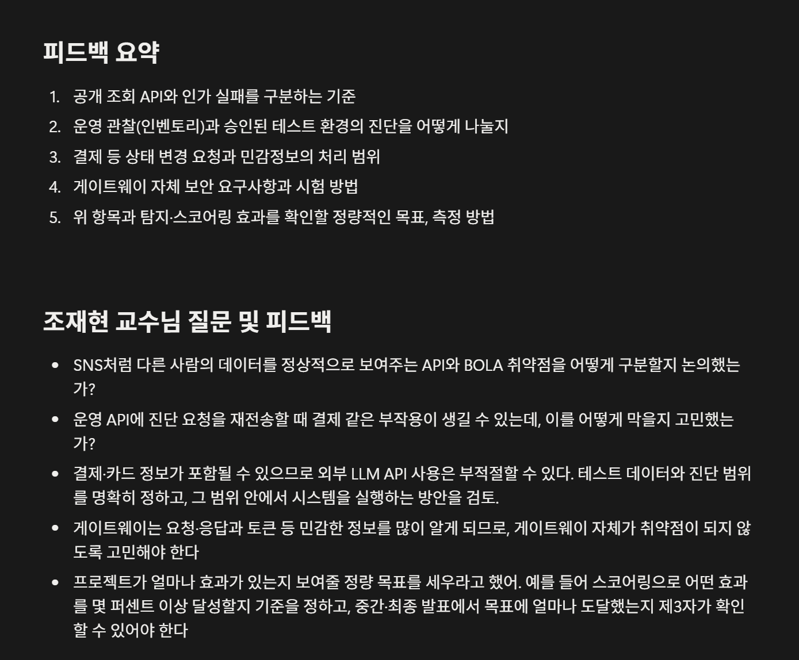
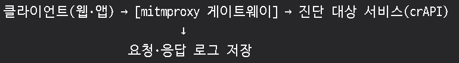
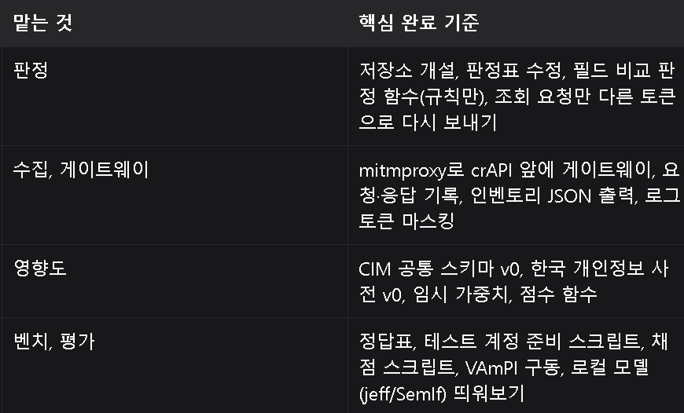
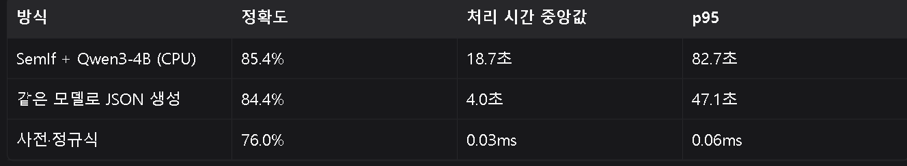
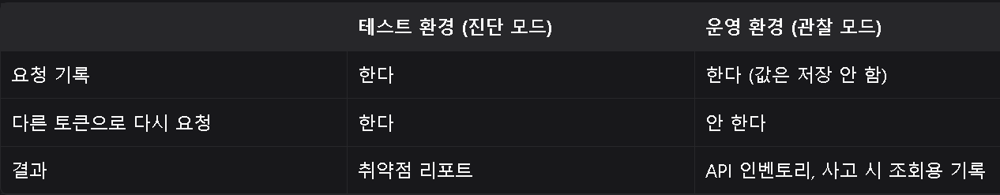

> 노션 원본: https://app.notion.com/p/3e993f3d10968025b78ddc29079dca0d (마지막 수정 2026-09-28), 2026-10-03 이관

# 0928 - 디벨롭

참고: [09.23 킥오프 발표 피드백](../review/2026-09-23%20킥오프%20발표%20피드백.md)

- 뭔가 만들어봐야지 진행이 되지 않을까요?

mitmproxy - crAPI

를 통해서 우리 시스템을 만들어보고 왜?

실제 기업 API를 트래픽으로 따서 가져오는 건 불법이니까!

- 취약점 탐지 부분까지 이미 잘 되어있는 것들이 있는데, 이 취약점 탐지 부분을 업그레이드 시켜야하나? 차별점이 없는것 아닌가?
	⇒ 물론 우리는 취약점 탐지만이 목적이 아니라 한국 개인정보보호법 기준으로 스코어링 하고, 피해 범위 파악 후 신고를 돕는 것까지.
	- 공개 프로필 API 오탐을 잃어나지 않는 솔루션이 차별점?

- 한국어 LLM을 통한 Semlf는 괜찮을까
- semlf 써도 느리다. 정확도가 낮다.

## 우리 프로젝트 강점
### 1. 대상 시스템을 건드리지 않는 진단
- 트래픽에서 관측한 ID로 조회 요청만 다시 보낸다. 리소스를 새로 만들거나 지우지 않는다.
- 쓰기 요청(결제 등)은 기본 차단한다.
- 기존: RESTler, BACFuzz는 퍼징 중에 리소스를 생성·삭제한다.
- 증명: 진단 전후 대상 DB 레코드 변화 0건
### 2. 근거가 보이는 판정
- 판정마다 "남에게 어떤 필드가 나갔는지"를 필드 단위로 남긴다.
- 애매한 건은 정상으로 넘기지 않고 "검토 필요"로 분리한다.
- 기존: AuthProbe는 심각도 등급, BacAlarm은 위반 확률만 낸다.
- 증명: 사람이 판정을 검토하는 시간 비교 (근거 있음 vs 없음)
### 3. 값을 남기지 않는 사고 대응 로그
- 응답 값은 저장하지 않고 "어떤 필드가 나갔는지"만 기록한다. 토큰은 마스킹한다.
- 로그가 털려도 개인정보 값은 나가지 않는다.
- 이 기록만으로 72시간 신고서의 "유출 항목"을 특정한다.
- 한계: 누구의 값이 나갔는지는 기업 DB에서 리소스 ID로 찾아야 한다.

게이트웨이 자체가 취약하다? (로그를 모으면 개인정보가 모일 수 있으니까!)

→ 운영 중에는 관찰 모드 / 실제 사후 진단 모드는 테스트 환경에서

→ 누가 언제 어떤 리소스를 봤는 지도 개인정보일 수 있다. 접근 통제, 암호화, 보관 기간은 필요

## 게이트웨이가 가진 위험

| 가진 것 | 뚫리면 공격자가 얻는 것 |
|---|---|
| 1. 지나가는 모든 요청과 응답 | 실시간 개인정보 값, 사용자들의 토큰 |
| 2. 쌓인 로그 | 과거 기록 전체 |
| 3. 테스트 계정 토큰 | 그 계정으로 로그인한 상태 |
| 4. **남의 토큰으로 다시 요청하는 기능** | **BOLA 공격 도구 그 자체** |

## 보안 대책

| 정한 것 | 막는 위험 |
|---|---|
| 운영에서는 관찰 모드만, 재전송은 테스트 환경에서만 | 4번. 운영 게이트웨이가 뚫려도 재전송 기능이 없으니 공격 도구가 안 된다. 테스트 환경이 뚫려도 가짜 데이터뿐이다 |
| 값은 저장 안 하고 필드 목록만 저장 | 2번. 로그가 털려도 개인정보 값이 없다 |
| 토큰 마스킹 | 1번과 2번. 로그에서 토큰을 훔쳐 재사용하지 못한다 |
| 테스트 계정 토큰은 메모리에만 | 3번. 디스크에 안 남는다 |
| 쓰기 요청 기본 차단 | 게이트웨이가 오작동하거나 악용돼도 결제나 삭제가 안 일어난다 |

화 대면 13시 금 대면 16시

→ 소통의 시간 오프라인

