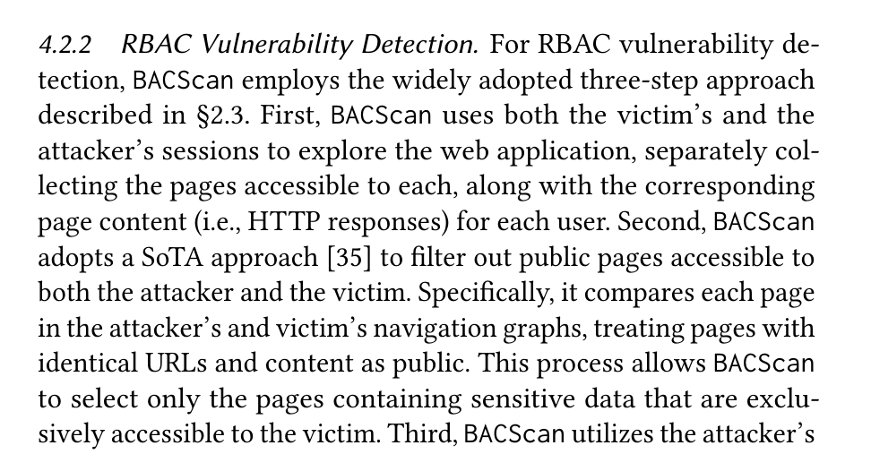
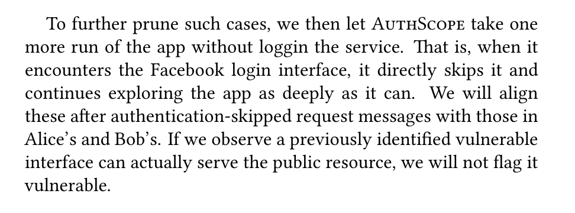
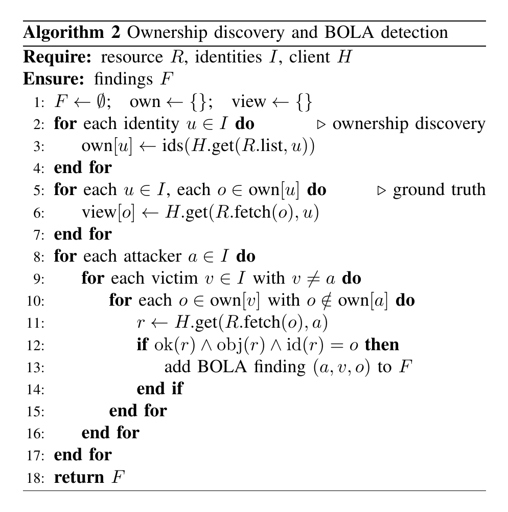
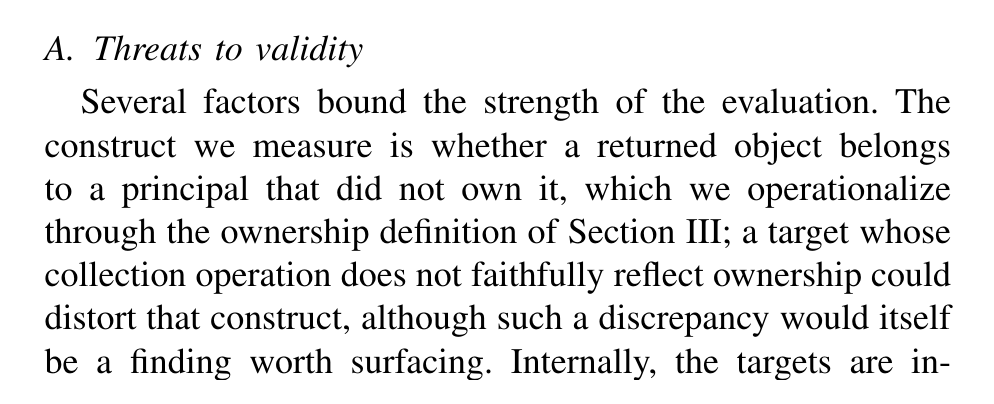
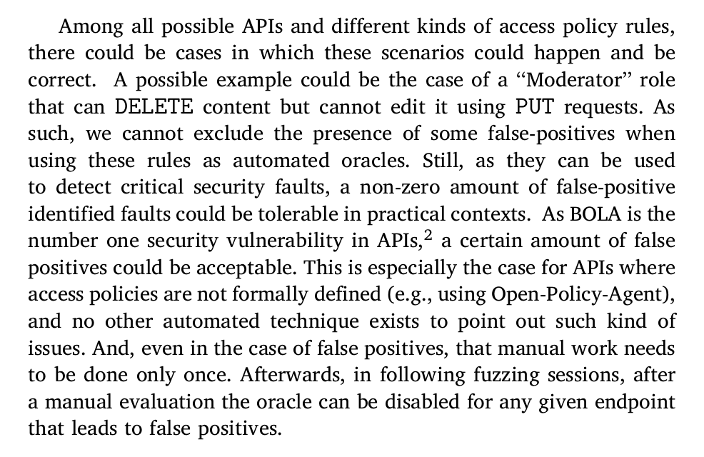
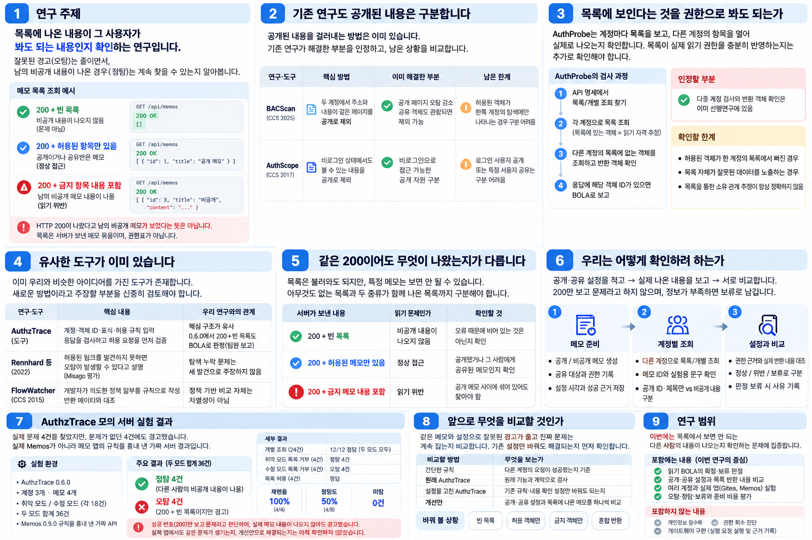
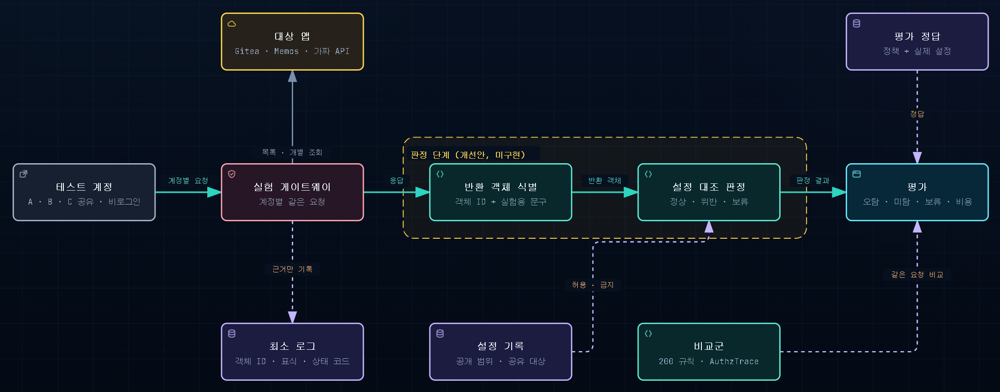

> 노션 원본: https://app.notion.com/p/3ed93f3d109680a2ac84c052e8f524a1 (문서 허브, 카테고리 브리핑, 마지막 수정 2026-10-02), 2026-10-03 이관. 노션 콜아웃은 인용문(>)으로, 열 배치는 순서대로 펼쳤다.

# 브리핑 [10/02]

## 1. 무엇을 알아보려는 연구인가

> **목록에 나온 내용이 그 사람이 봐도 되는 내용인지 확인하는 연구입니다.** 잘못된 경고는 줄이면서, 남의 비공개 내용이 나온 경우는 계속 찾을 수 있는지 알아봅니다.

**200이 나와도 남의 비공개 메모가 나왔다는 뜻은 아닙니다.**
- 비공개 메모를 빼고 빈 목록을 보여줬다면, 그 요청에서 메모가 새어 나온 것은 아닙니다.
- 비공개 메모 내용이 보였다면 문제입니다.
- **목록**은 서버가 보내준 메모 묶음이며, 누가 봐도 되는지 적은 권한표가 아닙니다.

자세히 보기

**연구 주제**

> **목록에 나온 내용이 그 사람이 봐도 되는 내용인지 확인하는 연구입니다.** 문제가 없는데 경고하는 일을 줄이면서, 남의 비공개 내용이 나온 경우는 계속 찾을 수 있는지 알아봅니다.

**목록에 나온 내용과 공개·공유 설정을 비교하는 읽기 BOLA 연구**

**무엇을 알아보나** 서버는 남의 비공개 메모를 빼고 빈 목록과 200을 보내줄 수 있습니다. 이때 요청은 성공했지만 비공개 메모가 나온 것은 아닙니다. 반대로 비공개 메모 내용이 나왔다면 문제입니다. 공개·공유 설정과 실제로 나온 내용을 함께 보고, 정보가 부족하면 아직 판단할 수 없다고 남깁니다.

**객체와 BOLA** 여기서 객체는 저장소, 게시글, 메모처럼 API가 조회하는 개별 데이터입니다. BOLA는 해당 객체를 읽을 권한이 없는 계정에 그 데이터가 반환되는 객체 수준 인가 취약점입니다. 다른 사람이 만든 객체라도 공개되어 있거나 공유받았다면 정상적으로 읽을 수 있습니다.

따라서 현재 검증할 질문은 **"목록을 불러왔다는 사실과 실제 메모 내용을 함께 보면, 잘못된 경고는 줄이고 진짜 문제는 계속 찾을 수 있는가?"**입니다.

**필요성**

> **200이 나왔다고 남의 비공개 메모가 보였다는 뜻은 아닙니다.** 목록이 비었는지, 봐도 되는 내용만 있는지, 남의 비공개 내용도 있는지를 확인해야 합니다.

**HTTP 200만으로 판정할 때** 가장 단순한 진단 규칙은 다른 계정의 요청에 HTTP 200이 반환되면 위반으로 보는 것입니다. 하지만 이 규칙은 공개 객체와 공유받은 객체도 위반으로 판단합니다. 접근이 성공했다는 사실만으로는 허용된 접근인지 알 수 없기 때문입니다.

**목록 조회에서 특히 중요한 차이** 예를 들어 B가 목록을 조회했을 때 A의 비공개 메모를 제외하고 빈 배열을 반환할 수 있습니다. 이 요청은 200으로 성공했지만 비공개 내용은 노출되지 않았습니다. 반면 같은 200 응답에 A의 비공개 본문이 들어 있다면 읽기 위반입니다.

**정상 공유 사례** 예를 들어 A가 만든 비공개 저장소를 B에게 공유했다고 가정합니다. B가 저장소를 조회하면 정상적으로 데이터가 반환됩니다. 이를 "타인 객체가 반환되었다"는 이유만으로 위반이라고 판단하면 오탐입니다.

**실제 위반 사례** 반대로 공유하지 않은 비공개 저장소가 B에게 반환됐다면 위반입니다. **두 경우의 응답은 비슷할 수 있지만, 허용 여부는 공유 설정에 따라 달라집니다.** 진단에는 응답 확인과 별도의 권한 근거가 함께 필요합니다.

**BOLA 탐지의 한계** 역할별 권한과 공식 정책 명세의 부재로 자동화된 탐지에서 거짓 양성이 발생할 수 있다

## 2. 기존 연구도 공개된 내용은 구분합니다

> **공개된 내용을 걸러내는 방법은 이미 있습니다.** 기존 연구가 해결한 부분을 인정하고, 남은 상황을 비교합니다.

- **BACScan**: 두 계정에서 주소와 내용이 같은 페이지를 찾아 검사에서 뺍니다. 공유받은 내용도 두 계정에서 같게 보였다면 빠질 수 있습니다.
- **AuthScope**: 로그아웃해도 볼 수 있는 내용을 찾아 검사에서 뺍니다. 로그인한 사람이나 공유받은 사람만 볼 수 있는지는 이것만으로 알기 어렵습니다.

BACScan 자세히 보기

**BACScan: 두 계정의 탐색 결과로 공개 페이지를 제외한다**

> **BACScan은 두 계정에서 주소와 내용이 같은 페이지를 찾아 검사에서 뺍니다.** 볼 수 있는 페이지인데 둘러보는 과정에서 못 찾았을 때는 어떻게 판단하는지 더 확인해야 합니다.

**판정 방법** BACScan은 피해자 계정과 공격자 계정으로 웹 애플리케이션을 각각 탐색합니다. 두 탐색 결과에서 URL과 내용이 같은 페이지를 공개로 취급하고 제외합니다. 남은 페이지는 공격자 계정으로 GET 요청을 재실행합니다. 응답 유사도가 기준을 넘으면 읽기 접근 위반으로 보고합니다.

두 계정의 탐색 결과에서 URL과 내용이 같은 페이지를 공개 자원으로 제외합니다.

**이미 해결한 부분** 이 방식은 공개 페이지에서 생기는 오탐을 줄이기 위한 방법입니다. 특정 사용자에게 공유된 페이지라도 두 계정이 모두 탐색하고 같은 내용을 관찰했다면 제외될 수 있습니다. 따라서 BACScan이 공유 객체를 처리하지 못한다고 주장할 수는 없습니다.

**검증할 한계** 우리가 확인하려는 조건은 **허용된 객체가 한쪽 계정의 탐색에만 나타나는 경우**입니다. 공유받은 계정이 직접 URL로는 접근할 수 있지만, 탐색 화면에서 해당 링크를 발견하지 못할 수 있습니다. 이 경우 공통 페이지 비교만으로는 그 객체를 허용된 접근으로 제외하기 어렵습니다.

해석 범위

실제 오탐으로 이어지는지는 아직 측정하지 않았습니다. 원문에서 언급한 크롤러의 불완전한 탐색으로 생기는 미탐과도 구분해야 합니다.

출처: Liu et al., *BACScan*, CCS 2025. [논문 원문](https://seclab.cse.cuhk.edu.hk/papers/ccs25-BACScan.pdf)

AuthScope 자세히 보기

**AuthScope: 비로그인 실행으로 공개 자원을 확인한다**

> **AuthScope는 로그아웃 상태에서도 볼 수 있는 내용을 찾아 검사에서 뺍니다.** 로그인한 사람만 보거나 특정 사람에게 공유한 내용은 이 확인만으로 알기 어렵습니다.

**판정 방법** AuthScope는 두 사용자의 요청을 비교해 사용자별 필드를 찾습니다. 그 필드를 치환한 뒤 응답을 비교해 인가 취약 후보를 식별합니다. 이후 앱을 로그인하지 않은 상태로 다시 실행합니다. 이때도 같은 공개 자원을 확인할 수 있다면 취약 후보에서 제외합니다.

비로그인 탐색에서 공개 자원을 확인하면 취약 후보에서 제외합니다.

**검증할 한계** 비로그인으로 조회할 수 있는 공개 자원에는 이 필터가 도움이 됩니다. 그러나 로그인 사용자 전체에게 공개된 객체나 특정 사용자에게만 공유된 객체는 비로그인 상태에서 접근할 수 없습니다. 비로그인 조회만으로는 이 두 경우의 정상 접근 근거를 얻기 어렵습니다.

해석 범위

이 한계를 곧바로 "로그인 공개와 공유 객체에서 항상 오탐한다"는 뜻으로 해석하지는 않습니다. 최종 결과는 앞선 필드 치환과 응답 비교 조건에도 달려 있습니다. 우리가 비교할 부분은 비로그인 필터가 확인하는 공개 범위와 실제 계정별 허용 범위의 차입니다.

출처: Zuo, Zhao, Lin, *AuthScope*, CCS 2017, §4.3. [논문 원문](https://bruceqczhao.github.io/assets/ccs17/CCS17.pdf)

## 3. 목록에 보인다는 것을 권한으로 봐도 되는가

> **AuthProbe는 계정마다 목록을 보고, 다른 계정의 항목을 열어 실제로 나오는지 확인합니다.** 목록에 나왔다는 사실과 그 사람이 봐도 된다는 사실이 같은지 확인해야 합니다.

- 서버의 잘못으로 남의 비공개 메모가 목록에 나왔다면, **보인다는 이유만으로 봐도 된다고 정하면 안 됩니다.**
- 반대로 공유받은 메모가 목록에서 빠졌다고 해서, **보면 안 된다고 정할 수도 없습니다.**
- 여러 계정을 쓰고 실제 항목이 나왔는지 확인하는 방법은 이미 있습니다.

AuthProbe 자세히 보기

**AuthProbe: 계정별 목록으로 읽기 자격을 추정한다**

> **AuthProbe는 계정마다 목록을 보고, 다른 계정의 항목을 열어 실제로 나오는지 확인합니다.** 목록에 나왔다는 이유만으로 그 사람이 봐도 되는 내용이라고 정해도 되는지 확인하려 합니다.

**판정 방법** AuthProbe는 API 명세에서 목록 조회와 개별 객체 조회를 찾습니다. 각 계정으로 목록을 조회하고 목록에 나타난 객체를 그 계정이 읽을 자격이 있는 객체로 정의합니다. 다른 계정의 목록에만 있는 객체를 조회했을 때 성공 응답에 해당 객체 ID가 일치하면 BOLA를 보고합니다.

목록으로 소유 객체를 정하고, 10·12행에서 다른 계정의 목록에 없는 객체가 반환되는지 검사합니다.

**이미 해결한 부분** 따라서 다중 계정 검사와 반환 객체 확인은 이미 선행연구에 있습니다. 공개·공유 객체가 두 계정의 목록에 모두 나타나면 이 교차 조회 검사에서 제외될 수 있습니다. 이 기능 자체를 우리 차별성으로 주장하지 않습니다.

**검증할 한계** 목록이 실제 읽기 권한을 충분히 반영하는지 확인합니다. 허용된 객체가 한 계정의 목록에서 빠지면, 목록 밖이라는 사실이 접근 금지로 해석될 수 있습니다. 반대로 목록 자체가 잘못된 데이터를 노출한다면, 관찰된 접근과 의도한 권한이 달라질 수 있습니다.

목록 조회가 소유 관계를 정확히 반영하지 않으면 판단이 왜곡될 수 있다고 인정합니다. 공개·공유 객체의 목록 누락은 우리가 검증할 조건입니다.

해석 범위

이 역시 목록을 이용하는 판정 절차에서 도출한 검증 조건입니다. 해당 조건에서 원도구가 실제로 어떤 결과를 내는지는 별도 실험으로 확인해야 합니다.

**실험에서 확인한 범위** 합성 채용 API의 취약 버전과 강화 버전 두 개를 평가합니다. 기본 탐지 실험은 두 계정이 각각 객체 3개를 가진 조건입니다. 이 결과만으로 공개·로그인 공개·특정 사용자 공유가 섞인 실제 앱의 성능까지 입증된 것은 아닙니다.

**객체 ID 입력만으로는 차별화하기 어렵다** 목록이 없을 때 명시적인 객체 입력을 제공하는 방법도 언급합니다. 따라서 테스트 객체 ID를 직접 준다는 사실만으로 차별성을 주장하지 않습니다. 추가할 근거는 ID뿐 아니라 객체의 공개 범위와 계정별 공유 관계입니다.

출처: *AuthProbe*, arXiv:2607.20574, 2026 사전논문, §III·§V-B Algorithm 2. [논문 원문](https://arxiv.org/html/2607.20574)

팀 논문 요약: [AuthProbe 요약](../../docs/research/%EB%85%BC%EB%AC%B8%20%EC%A0%95%EB%A6%AC/AuthProbe.md)

EvoMaster 참고: 수정·삭제 검사이므로 이번 읽기 비교와 구분

**EvoMaster 확장: 수정 동사의 권한 검사 일관성을 확인한다**

> **EvoMaster는 같은 항목을 수정하거나 삭제할 때 결과가 다른지를 확인합니다.** 원래 수정과 삭제를 다르게 허용할 수도 있으므로, 이번 목록 읽기 검사와는 구분합니다.

**판정 방법** 같은 계정이 같은 객체에 PUT·PATCH·DELETE를 요청했을 때, 일부는 403으로 거부되고 다른 수정 요청은 2xx로 성공하는지 확인합니다. 이 불일치를 권한 검사 누락의 후보로 보고합니다.

**이미 해결한 부분** 객체의 권한표 전체를 입력하지 않고도 수정 요청 사이의 불일치로 취약 후보를 찾습니다. 발견한 요청은 실행 가능한 테스트로 생성하여 재현과 수정 확인을 지원합니다.

**남는 판단 문제** 수정 동사마다 권한이 다른 정상 정책도 있습니다. 예를 들어 관리자가 콘텐츠를 삭제할 수 있지만 편집은 할 수 없도록 설계할 수 있습니다. 원문도 이런 오탐 가능성을 인정하고 수동 평가 후 해당 엔드포인트의 오라클을 비활성화할 수 있다고 설명합니다.

삭제는 허용하지만 편집은 금지하는 정상 정책에서도 오탐이 생길 수 있으며 수동 평가 후 해당 판정 규칙을 비활성화할 수 있다고 설명합니다.

**우리 연구와 비교할 범위** §3.3의 해당 오라클은 PUT·PATCH·DELETE 간 비교입니다. 따라서 공개·비공개·공유 객체의 GET 결과에 직접 적용되는 비교군으로 취급하지 않습니다. 읽기 결과의 허용 여부를 판단할 별도 근거가 필요하다는 문제의식과, 재현 가능한 테스트를 남기는 방법을 참고합니다.

요약을 원문과 대조한 내용

§3.3은 단순히 "A가 거부되고 B가 성공하면 BOLA"라고 판단하는 절차가 아닙니다. 핵심은 같은 계정·같은 객체에서 수정 동사 간 결과를 비교하는 것입니다. 또한 §5의 사후 처리는 퍼징 결과로 보안 테스트를 생성하는 단계입니다. 사람의 정책 검토와 같은 뜻으로 사용하지 않습니다. §7의 LLM 언급은 발견된 결함의 종류를 분류할 후속 가능성입니다. BOLA 오탐 감소를 검증한 결과로 쓰지 않습니다.

출처: Şahin, Zhang, Arcuri, *Enhancing REST API fuzzing with access policy violation checks and injection attacks*, Journal of Systems and Software 243, 113060, §3.3·§5·§7. 2027년 권호의 온라인 공개본입니다. [학술지 원문](https://doi.org/10.1016/j.jss.2026.113060)

팀 논문 요약: [EvoMaster 요약](../../docs/research/%EB%85%BC%EB%AC%B8%20%EC%A0%95%EB%A6%AC/EvoMaster%20-%20Enhancing%20REST%20API%20fuzzing.md)

## 4. 우리 생각과 비슷한 도구가 이미 있습니다

> **AuthzTrace는 계정·객체 번호·누가 봐도 되는지를 파일에 적어 검사하는 도구입니다.** 기본 방식은 우리 초기 생각과 겹칩니다. 새 방법이라고 주장할 부분은 아직 확인해야 합니다.

- **AuthzTrace**는 테스트 객체에 넣은 표식 문구 실험용 문구가 다른 사람에게 나왔는지도 확인합니다.
- **Rennhard 논문**도 볼 수 있는 페이지를 못 찾아 잘못 경고하는 문제를 설명합니다.
- **FlowWatcher**도 미리 정한 규칙과 실제로 나온 내용을 비교합니다.

**그래서 목록 조회에서 나타난 구체적인 실수를 중심으로 주제를 좁힙니다.**

자세히 보기

**추가 조사: 탐색 누락과 정책 입력을 다룬 연구·도구**

> **볼 수 있는 내용을 못 찾아 잘못 경고하는 문제와, 규칙을 미리 적는 방법은 이미 있습니다.** 우리 생각과 겹치는 부분을 인정하고 실제로 어떤 실수를 줄일 수 있는지 확인해야 합니다.

| 연구·도구 | 이미 해결하거나 설명한 부분 | 우리 연구에 반영할 내용 |
|---|---|---|
| Rennhard 등, 2022 웹 인가 취약점 탐지 논문 | 허용된 내용의 링크를 발견하지 못하면 오탐이 발생할 수 있다고 설명합니다. Misago에서는 사용자별 공개 글을 준비해 프로필 링크가 발견되도록 보완했습니다. | 목록 누락 문제를 새 발견으로 주장하지 않습니다. 탐색과 테스트 데이터를 보완하는 방법도 비교합니다. [학술지 원문: Misago 평가·Discussion](https://link.springer.com/article/10.1007/s42979-022-01271-1) |
| FlowWatcher, CCS 2015 정책 기반 노출 차단 프록시 | 개발자가 의도한 정책 일부를 규칙으로 작성합니다. 생성·공유 등 HTTP 요청에 따라 권한 상태를 갱신하고 반환 데이터와 대조합니다. | 의도한 권한과 실제 반환을 분리하는 것 자체는 차별성이 아닙니다. 앱별 규칙 작성·필드 연결·갱신 비용을 비교해야 합니다. [논문 원문: §3·§4](https://lsds.doc.ic.ac.uk/sites/default/files/ccsfp224-muthukumaran_0.pdf) |
| AuthzTrace 논문이 아닌 공개 테스트 도구 | 계정·객체 ID·표식·허용 규칙을 입력하고 응답을 검사합니다. 소유자·특정 계정·로그인 사용자·전체 공개를 표현합니다. 허용 요청을 먼저 검사해 준비 실패를 구분합니다. | 핵심 판정 구조는 우리 기존 설계와 겹칩니다. 팀원 보고에서는 0.6.0이 가짜 API의 정상적인 200+빈 목록도 BOLA로 판정했습니다. 본문의 반환 객체와 권한을 대조하는 개선안을 같은 계약·요청으로 비교할 후보입니다. [공식 README](https://github.com/Asttr0/AuthzTrace#readme) |

**그래서 주제를 이렇게 좁힙니다.** 규칙을 적고 실험용 내용을 확인하는 방법은 이미 있습니다. 지금 알아볼 것은 **목록을 불러오는 데 성공했다는 이유만으로, 남의 비공개 내용을 봤다고 잘못 판단하는 문제**입니다. 실제 앱에서도 생기는지, 기존 설정만 바꿔 해결되는지, 내용을 직접 확인하면 실수가 줄어드는지 보겠습니다.

ZAP·BOLABuster와 추가 원문 확인 사항

**ZAP**는 Allowed·Denied·Unknown 규칙과 부모 URL 규칙 상속을 지원합니다. 따라서 기존 방법의 입력 비용을 "모든 객체 권한을 하나씩 작성한다"로 가정하지 않습니다. 입력의 Unknown과 우리 판정 결과의 보류를 같은 기능으로 단정하지 않습니다. [ZAP 공식 문서](https://www.zaproxy.org/docs/desktop/addons/access-control-testing/)

**BOLABuster**는 AI로 테스트를 생성하고 응답을 분석하며, 최종 취약 후보는 사람이 확인합니다. 공개·공유 오탐을 처리하지 못한다고 단정하지 않습니다. 공개된 오탐률을 확인하지 못했으므로 정량 비교 수치로 사용하지 않습니다. [공식 소개](https://unit42.paloaltonetworks.com/automated-bola-detection-and-ai/)

**추가 확인**: 팀이 찾은 정책 계약 논문(10.1016/j.cola.2026.101424)은 원문 내용 확보 후 중복 여부를 검토해야 합니다.

팀 조사 근거: [양유상 볼라 논문 조사](../../docs/research/%EC%96%91%EC%9C%A0%EC%83%81%20%EB%B3%BC%EB%9D%BC%20%EB%85%BC%EB%AC%B8%20%EC%A1%B0%EC%82%AC.md) · [api Bola 탐지 툴 조사](../../docs/research/api%20Bola%20%ED%83%90%EC%A7%80%20%ED%88%B4%20%EC%A1%B0%EC%82%AC.md)

## 5. 같은 200이어도 무엇이 나왔는지가 다릅니다

> **봐도 되는 메모만 나왔다면 정상이고, 남의 비공개 내용이 나왔다면 문제입니다.** 아무것도 없는 목록과 두 종류가 함께 나온 목록까지 구분해야 합니다.

| 서버가 보내준 내용 | 읽기 문제인가 | 확인할 것 |
|---|---|---|
| 200 + 빈 목록 | 비공개 내용이 나오지 않았습니다. | 오류 때문에 비어 있는 것은 아닌지 먼저 확인합니다. |
| 200 + 봐도 되는 메모만 있음 | 정상입니다. | 공개됐거나 그 사람에게 공유된 메모인지 봅니다. |
| 200 + 보면 안 되는 메모 내용이 있음 | 문제입니다. | 공개 메모 사이에 섞여 있어도 찾아야 합니다. |

**목록은 불러와도 되지만 특정 메모는 보면 안 될 수 있습니다.** 기존 도구에 규칙을 잘못 적은 것인지, 도구가 내용을 잘못 판단하는 것인지 먼저 구분합니다.

자세히 보기

**같은 사례로 직접 비교**

> **같은 200이어도 아무것도 없는 목록과 남의 비공개 내용이 나온 목록은 다릅니다.** 기존 도구의 결과는 팀원 보고이며, 바꾸려는 방법이 실제로 잘되는지는 아직 확인하지 않았습니다.

**핵심 사례: 같은 200이어도 반환 내용이 다릅니다**

> **봐도 되는 메모만 나왔다면 정상이고, 남의 비공개 내용이 나왔다면 문제입니다.** 두 종류가 함께 나왔을 때도 메모 하나씩 공개·공유 설정과 비교해야 합니다.

| 응답 내용 | 읽기 BOLA 정답 | AuthzTrace 0.6.0 팀원 보고 | 개선안의 목표 |
|---|---|---|---|
| 200 + 빈 목록입니다. | 이 요청에서 비공개 내용 누출이 없습니다. | 고친 가짜 API에서 오탐 4건을 보고했습니다. | 유효한 응답임을 확인한 뒤 위반 미관측으로 구분합니다. |
| 200 + 허용된 객체만 있습니다. | 정상 접근입니다. | 혼합 목록 비교는 아직 보고되지 않았습니다. | 허용 객체를 위반으로 판정하지 않습니다. |
| 200 + 금지 객체의 보호 내용이 포함됩니다. | 읽기 위반입니다. | 취약한 가짜 API에서 정탐 4건을 보고했습니다. | 응답 전체의 성공 여부와 별개로 금지 객체 누출을 탐지합니다. |

**도구에 적어 둔 규칙이 맞는지도 봅니다.** 목록은 불러와도 되지만 다른 사람의 비공개 메모는 나오면 안 될 수 있습니다. 규칙을 잘못 적어서 생긴 경고인지, 도구가 내용을 잘못 판단한 것인지 확인해야 합니다. 기존 설정만 바꿔도 해결되는지는 아직 확인하지 않았습니다.

**보조 사례: 공유 상태와 탐색·목록 관찰**

> **공유받은 항목이 화면이나 목록에서 빠진 경우도 참고로 비교합니다.** 아래 표는 논문의 설명을 바탕으로 정리했으며 실제 실행 결과는 아닙니다.

| 비교 사례 | BACScan 읽기 검사 | AuthProbe 교차 조회 검사 | 우리 판정안 |
|---|---|---|---|
| B에게 공유되어 있고 두 계정 모두 관찰 | URL·내용이 같은 공통 페이지라면 제외할 수 있습니다. | 두 목록 모두에 객체 ID가 있으면 제외합니다. | 공유 설정 근거에 따라 허용된 접근으로 판단합니다. |
| B에게 공유되었지만 B의 탐색·목록에서는 빠짐. 직접 조회는 성공 | 공개 페이지 제외 단계에서 검사 대상으로 남고 응답 유사도 조건을 충족하면 위반으로 보고할 수 있습니다. | B 목록에는 없고 조회 응답의 객체 ID가 일치하면 위반으로 보고합니다. | 공유 설정 근거에 따라 허용된 접근으로 판단합니다. |
| B에게 금지된 비공개 객체가 개별 조회에서 누출 | 필터에서 제외되지 않고 유사도 조건을 충족하면 위반으로 보고합니다. | A 목록에만 있고 B 응답의 객체 ID가 일치하면 위반으로 보고합니다. | 금지 설정 근거와 객체 반환 확인으로 위반을 확정합니다. |
| B에게 금지된 객체가 목록·탐색까지 누출되어 두 계정 모두 관찰 | 공통 페이지로 제외될 수 있습니다. | 두 목록 모두에 있으면 해당 교차 조회 검사에서 제외합니다. | 독립적인 금지 설정 근거가 유지되면 위반을 확정합니다. |

**비교 조건** A가 객체를 만들고 B가 조회한다고 가정합니다. B에게 공유한 객체와 공유하지 않은 비공개 객체를 구분합니다. 여기에 각 계정의 탐색·목록에 객체가 나타나는 조건을 달리합니다.

**표를 읽는 기준** 위 표는 **논문 절차를 같은 조건에 대입한 분석**입니다. 도구를 실행해 얻은 성능 결과는 아닙니다. BACScan의 응답 유사도와 AuthProbe의 객체 ID 일치 등 각 판정 조건이 충족되는 경우를 기준으로 정리했습니다.

**비교에서 볼 차이** 이 표는 관찰 기반 두 방법과 우리 판정안을 비교한 것입니다. AuthzTrace에 B의 읽기를 허용하는 규칙을 넣으면, 목록에서 빠져도 정상 접근으로 판정할 수 있습니다. 따라서 우리만 이 사례를 처리한다고 주장하지 않습니다. 관찰 기반 방법의 탐색 보완과 정책 입력 방식의 준비 비용까지 함께 비교합니다.

## 6. 우리는 어떻게 확인하려 하는가

> **공개·공유 설정을 적고 → 실제 나온 내용을 보고 → 서로 비교합니다.** 아직 더 좋은 방법인지 확인하지 않았으며, 기존 설정만 바꿔 해결될 가능성도 먼저 봅니다.

1. **메모를 준비합니다.** 누구나 볼 수 있는 메모와 작성자만 볼 수 있는 메모를 만들고, 공유한 사람을 적습니다.
2. **다른 계정으로 목록을 불러옵니다.** 메모 번호와 실험용 문구로 실제 어떤 메모 내용이 나왔는지 확인합니다.
3. **설정과 비교합니다.** 봐도 되는 메모는 정상으로, 보면 안 되는 메모 내용이 나오면 문제로 구분합니다. 정보가 부족하면 아직 판단할 수 없다고 남깁니다.

**번호나 공개된 제목만 보인 경우와 비공개 내용까지 나온 경우는 구분합니다.**

자세히 보기

**개선하려는 점과 차별성**

> **목록을 불러오는 데 성공했는지와, 그 안의 메모를 봐도 되는지를 따로 확인하려 합니다.** 기존 도구의 설정만으로 해결될 수도 있으므로, 새로운 방법이라고 말하기 전에 같은 조건에서 비교하겠습니다.

공개 객체, 여러 계정, 객체 표식, 별도 정책 입력 자체는 새로운 점이 아닙니다. AuthProbe도 반환 객체를 확인하므로 본문 확인 자체를 최초로 제안했다고 주장하지 않습니다. **단순한 상태 코드 조건 수정으로 끝난다면 연구 기여가 약할 수 있습니다.** 실제 앱의 여러 목록 응답에서 실패 조건과 개선 효과를 확인해야 합니다.

**판정 절차**

> **공개·공유 설정을 적고 → 실제 나온 내용을 보고 → 서로 비교합니다.** 200만 보고 문제라고 하지 않으며, 설정이나 내용을 확인할 수 없으면 아직 판단할 수 없다고 남깁니다.

1. **객체를 만들 때 설정을 기록합니다.** 객체 ID, 생성자·소유자 계정, 공개 범위, 공유 대상과 공유 권한을 남깁니다. 기록한 설정과 앱 정책에 따라 계정별 읽기 허용·금지를 정합니다. 설정 시각과 설정 성공 근거도 남겨 진단 직전의 상태를 확인합니다.
2. **계정별로 조회하고 설정과 대조합니다.** 각 계정으로 같은 목록과 개별 객체를 조회합니다. 정상적인 목록 응답인지 확인한 뒤, 포함된 테스트 객체의 ID와 비공개 본문에 넣은 합성 표식을 대조합니다. 공개된 ID·제목만 반환된 경우와 보호된 내용이 반환된 경우를 구분합니다. 진단 직전 설정을 재확인한 뒤, 이 결과를 기록한 읽기 권한과 대조합니다.
3. **근거와 조회 결과에 따라 판정합니다.** 아래 기준으로 정상 접근, 위반, 보류를 구분합니다.

보류할 때는 사유를 기록해 추가로 확인할 근거를 보여줍니다.

| 권한 근거와 조회 결과 | 판정 |
|---|---|
| 읽기가 허용된 계정에 대상 객체가 반환됩니다. | 정상 접근 |
| 읽기가 금지된 계정에 대상 객체의 보호된 내용이 반환됩니다. | 위반으로 확정 |
| 목록 요청이 제대로 처리됐고, 보면 안 되는 실험용 메모 내용이 나오지 않았습니다. | 그 요청에서는 문제가 보이지 않았습니다. 앱 전체가 안전하다는 뜻은 아닙니다. |
| 공개·공유 설정이 바뀌었거나, 누가 봐도 되는지 또는 어떤 내용이 나왔는지 확인할 수 없습니다. | 판정 보류 |

**같은 응답이라도 설정에 따라 판정이 달라집니다**

> **같은 메모가 보여도 공유받은 사람이 보면 정상이고, 보면 안 되는 사람이 보면 문제입니다.** 공유받은 메모가 목록에서 빠졌어도, 그 사람이 볼 수 있다는 사실을 제대로 구분하는지 확인합니다.

A가 만든 비공개 객체를 B에게 공유한 경우와 공유하지 않은 경우를 준비합니다. 아래는 **B의 조회 응답에 대상 객체의 내용이 반환된 경우**입니다.

| 설정과 관찰 조건 | 설정 근거에 따른 판정 |
|---|---|
| B에게 공유해 읽기를 허용했습니다. | 정상 접근입니다. |
| B에게 공유했지만 B의 목록에서는 객체가 빠졌습니다. | 설정 근거상 정상 접근입니다. 목록에서 빠져도 이 판정을 유지하는지 확인합니다. |
| B에게 공유하지 않았으며, 앱 정책상 B의 읽기가 금지되어 있습니다. | 위반입니다. |

**필요한 입력과 기여의 검증 조건**

> **실험용 메모를 누가 봐도 되는지는 미리 적어야 합니다.** 모든 운영 데이터의 권한표를 만드는 것은 아니지만, 정보 없이 판단하는 방법도 아닙니다.

**성능과 준비 비용을 함께 확인합니다.**
- 같은 권한 근거를 둔 채 **상태 코드 중심 판정과 반환 객체 대조의 오탐·미탐 차이**를 확인합니다.
- **앱 정책 해석, 설정 필드 연결, 상태 재확인, 준비 시간과 수동 입력 항목 수**를 함께 측정합니다.
- **같은 사례의 준비 비용**과 **같은 준비 시간 안에서 평가할 수 있는 사례 수**를 비교합니다.
- 모든 평가 객체의 권한을 사람이 적는 작업과 사실상 같다면, **연구 기여가 부족할 수 있습니다.**

## 7. AuthzTrace 모의 서버 실험 결과

> **실제 문제 네 건을 찾았지만, 문제가 없던 네 건에도 경고했다고 합니다.** 실제 Memos가 아니라 메모 앱의 규칙을 흉내 낸 가짜 서버 결과입니다.

[Authztrace 정탐 오탐 비교표](../../docs/research/api%20Bola%20%ED%83%90%EC%A7%80%20%ED%88%B4%20%EC%A1%B0%EC%82%AC/Authztrace%20%EC%A0%95%ED%83%90%20%EC%98%A4%ED%83%90%20%EB%B9%84%EA%B5%90%ED%91%9C.md)

**AuthzTrace 0.6.0 · 계정 3개 · 메모 4개 · 두 모드 합계 36건**

| 가짜 서버의 동작 | 도구가 한 판단 | 결과 |
|---|---|---|
| 다른 사람의 비공개 내용이 나왔습니다. | 문제라고 경고했습니다. | 맞게 찾은 것 4건 |
| 비공개 내용을 빼고 200 + 빈 목록을 보냈습니다. | 여전히 문제라고 경고했습니다. | 잘못 경고한 것 4건 |

**팀원 설명**: 성공 번호를 보고 먼저 문제라고 정해서, 실제 메모 내용이 나오지 않아도 경고했다고 합니다. 이번 발표 준비에서는 원본 실행 기록을 다시 확인하지 않았습니다. 실제 앱에서 같은 문제가 생기는지, 우리가 바꾼 방법으로 해결되는지도 아직 확인 전입니다.

자세히 보기

**팀원 보고: AuthzTrace 0.6.0의 가짜 API 테스트**

> **팀원은 비공개 메모가 나오지 않은 빈 목록에도 잘못된 경고가 네 번 났다고 보고했습니다.** 메모 앱의 규칙을 흉내 낸 가짜 서버의 결과이며, 원본 기록과 실제 앱에서도 확인해야 합니다.

**환경과 근거 수준** 팀원이 제공한 Markdown 보고서 기준입니다. 이번 브리핑 준비에서 원본 계약·실행 로그는 재검증하지 않았습니다. Memos 0.9.0의 개별·목록 조회 규칙을 흉내 낸 가짜 API에 취약 모드와 가상의 수정 모드를 준비했습니다. 계정 3개, 메모 4개이며 모드당 18건, 두 모드 합계 36건입니다.

| 검사 범위 | 보고된 결과 | 해석 |
|---|---|---|
| 개별 조회: 모드당 12건, 합계 24건입니다. | 두 모드 모두 12/12건을 맞게 판정했습니다. | 이 가짜 API의 개별 조회에서는 공개·로그인 공개·비공개를 구분했습니다. |
| 취약 모드의 목록 거부 검사 4건입니다. | 남의 비공개 내용이 반환됐고 BOLA 4건을 보고했습니다. | 정탐 4건입니다. |
| 수정 모드의 목록 거부 검사 4건입니다. | 200+빈 목록이 반환됐지만 BOLA 4건을 보고했습니다. | 오탐 4건입니다. |
| 목록 허용 검사: 모드당 2건, 합계 4건입니다. | 자기 목록 조회를 맞게 판정했다고 보고했습니다. | 모드당 목록 6건에서 거부 4건을 뺀 집계입니다. |

**이 36건에서의 집계** 실제 위반 4건, 정탐 4건, 미탐 0건, 오탐 4건입니다. 재현율은 4/4=100%, 정밀도는 4/8=50%입니다. 가짜 API 한 개의 사례 수치이며 일반 성능으로 제시하지 않습니다.

**팀원이 설명한 이유** 금지라고 적어 둔 요청에서 200 같은 성공 번호가 나오면, 실제 메모 내용이 나왔는지와 별개로 문제라고 정했다고 합니다. 취약 모드와 수정 모드의 요약이 모두 pass 14, fail 4, bola 4로 같았다고 합니다. 허용·거부 상태 코드 설정은 계약 전체에 적용됐으며, 엔드포인트별 우회는 찾지 못했다고 보고했습니다. 불가능하다고 확정한 결과는 아닙니다.

**남은 확인** 기존 계약의 허용 규칙·응답 검증 설정으로 해결되는지 먼저 확인합니다. 그다음 실제 Memos에서 정상 목록과 보호 내용 누출을 재확인하고 개선안과 비교합니다. 약 20ms의 로컬 가짜 API 시간은 실제 앱의 실행 성능 근거로 사용하지 않습니다.

팀원이 보고한 다른 제한과 보조 평가

허용 사전 검사가 실패하면 전체 거부 검사가 중단됐다고 보고했습니다. 해당 첫 실행의 JSON은 보존되지 않았다고 하므로 핵심 성능 근거로 사용하지 않습니다. 같은 소유자의 공개·비공개 객체를 별도 리소스로 선언했다고 합니다. 객체별 명시 계약 항목은 테스트하지 않았다고 하므로 형식상 불가능하다고 주장하지 않습니다. 이 두 항목은 준비·실패 처리 비용의 보조 평가이며 이번 연구의 본체와 구분합니다.

참고: Gitea·Memos 소개와 이전 예비 결과 8/18·3/6

**현재 확인한 결과와 아직 확인하지 못한 것**

> **기존 예비 결과와 팀원이 보낸 가짜 서버 결과는 따로 설명합니다.** 팀원은 빈 목록에도 잘못된 경고가 났다고 보고했으며, 실제 Memos나 바꾼 방법에서 확인한 결과는 아닙니다.

> **Gitea는 어떤 서비스?**
> 서버에 설치해 사용하는 오픈소스 코드 관리·협업 서비스입니다. GitHub처럼 소스 코드를 저장하고 변경 이력과 이슈를 관리합니다.
> **실험에서 사용하는 이유** 저장소를 공개·비공개로 설정하거나 특정 계정을 협업자로 추가할 수 있습니다. 우리는 저장소와 그 안의 이슈를 테스트 객체로 사용합니다. 다른 사람이 만든 객체라도 공개되었거나 공유받았다면 정상적으로 읽을 수 있다는 사례를 만드는 데 적합합니다.
> 서비스 소개: [Gitea 공식 문서](https://docs.gitea.com/1.24/)

> **Memos는 어떤 서비스?**
> 서버에 설치해 사용하는 오픈소스 메모 앱입니다. 사용자가 짧은 메모를 작성하고 웹 화면이나 API로 조회합니다.
> **실험에서 사용하는 이유** 실험에 사용하는 0.9.0 버전에서는 메모의 공개 범위를 전체 공개, 로그인 사용자 공개, 작성자만 접근하는 비공개로 나눕니다. 우리는 메모 한 개를 테스트 객체로 사용합니다. 같은 조회 성공이라도 메모의 공개 범위와 조회한 계정에 따라 정상 접근인지 위반인지 달라지는 사례를 비교합니다.
> 서비스 소개: [Memos 공식 문서](https://usememos.com/docs)

**Gitea: 단순 규칙 오탐 8/18** 저장된 예비 실험에서는 "타인 계정의 HTTP 200은 위반"이라는 단순 규칙을 확인했습니다. Gitea에서는 전체 정상 요청 18건 중 8건을 오탐했습니다. 공개 저장소·이슈 조회 6건과 협업자로 공유받은 조회 2건입니다.

**Memos: 단순 규칙 오탐 3/6** Memos의 개별 메모 조회에서는 정상 요청 6건 중 3건을 오탐했습니다. 공개 메모와 로그인 사용자 공개 메모가 원인이었습니다. 두 예비 실험에서 실제 읽기 위반은 확인하지 않았습니다.

**기존 예비 결과의 의미** Gitea 8/18과 Memos 3/6은 단순 규칙의 오탐을 보여줍니다. 이 두 실앱 예비 결과에는 실제 위반 사례가 없어 재현율을 계산할 수 없습니다. 위 가짜 API 보고의 4건 위반과 분모를 합치지 않습니다.

## 8. 앞으로 무엇을 비교할 것인가

> **같은 메모와 설정으로 잘못된 경고가 줄고 진짜 문제는 계속 잡는지 비교합니다.** 기존 설정만 바꿔 해결되는지 먼저 확인하고, 준비와 확인에 드는 시간도 셉니다.

### 정량 목표

> **기존 도구는 목록 조회에서 200이면 위반으로 판정해 정상 빈 목록을 100% 잘못 경고하고, 경고의 정밀도는 50%에 그쳤습니다.** 우리는 응답에 실제로 나온 객체를 공개·공유 설정과 대조해, **위반 재현율 95% 이상을 유지하면서 정상 목록 오탐률을 5% 이하로, 정밀도를 90% 이상으로** 올리는 것을 목표로 합니다.

| 지표 | 목표 | 의미 |
|---|---|---|
| 정상 목록 오탐률 (빈 목록·허용 객체만 나온 목록 중 위반으로 잘못 판정한 비율) | **5% 이하** | 잘못된 경고를 거의 없앱니다 |
| 위반 재현율 (실제 위반 중 잡은 비율, 보류한 위반은 놓친 것으로 계산) | **95% 이상 유지** 혼합 목록 포함 | 경고를 줄이다가 진짜 유출을 놓치면 실패입니다 |
| 정밀도 (위반 경고 중 실제 위반 비율) | **90% 이상** | 경고가 뜨면 믿을 수 있어야 합니다 |
| 보류율 (설정이 모두 있는 사례 기준) | **10% 이하** | 사람에게 넘기는 양을 제한합니다 |
| 준비 시간 | 설정을 고친 AuthzTrace 대비 **+20% 이내** | 비싼 입력으로 정확도를 산 것이 아님을 보입니다 |
| 평가 규모 | 실제 앱 요청 **200건 이상**, 실제 위반 **20건 이상** | 소수 사례의 우연이 아님을 보입니다 |

목표치를 읽을 때 주의할 점

목표는 실험 전에 정한 기준이며 측정 결과가 아닙니다. 기준선 100%·50%는 가짜 API 한 개, 목록 거부 검사 8건의 팀원 보고입니다. 원본 실행 기록으로 재확인한 뒤 확정합니다. 설정을 고친 AuthzTrace가 이미 목표를 달성하면 개선안의 성과로 보지 않습니다. 이 경우 목표를 설정 보완판 대비 오탐률 또는 준비 시간 차이로 다시 정합니다. 보류율 10%, 준비 시간 +20%, 평가 규모 200건은 시작값이며 팀 회의에서 확정합니다.

| 서로 비교할 방법 | 무엇을 보는가 |
|---|---|
| 간단한 규칙 | 요청이 성공했는지 봅니다. |
| 원래 AuthzTrace | 원래 기능과 계약으로 검사합니다. |
| 설정을 고친 AuthzTrace | 기존 규칙·내용 확인 설정만 바꿔도 해결되는지 봅니다. |
| 실제 메모 내용을 비교하는 방법 | 공개·공유 설정과 목록에 나온 메모를 하나씩 비교합니다. |

**바꿔 볼 상황**: 빈 목록 / 봐도 되는 메모만 있음 / 보면 안 되는 메모가 나옴 / 두 종류가 함께 나옴
- **실제 앱 확인**: 가짜 서버 결과를 다시 확인한 뒤 실제 Memos에서도 검사합니다. Gitea는 공개·공유 상황을 추가로 확인합니다.
- **정답 확인**: 앱 설명과 실제 공개·공유 설정을 따로 봅니다. 프로그램에 적은 답을 그대로 정답으로 가져오지 않습니다.
- **결과 확인**: 잘못 경고한 수, 진짜 문제를 찾거나 놓친 수, 판단하지 못한 수와 준비 시간을 셉니다. 실제 문제인데 판단을 미뤘다면 못 찾은 것으로 계산합니다.

자세히 보기: 실험 대상·추가 비교 방법·평가 지표와 비용

**무엇을 실험하고 어떻게 평가할 것인가**

> **같은 메모와 설정으로 잘못된 경고가 줄고 진짜 문제는 계속 잡는지 비교합니다.** 기존 설정만 바꾸면 해결되는지도 먼저 보고, 준비에 걸리는 시간도 확인합니다.

**실험 대상과 역할**

> **Gitea에서는 공개·공유된 내용을 잘못 경고하는지, Memos에서는 비공개 내용이 실제로 나오는지 봅니다.** 설정을 직접 바꾸고, 비공개 내용이 나오지 않도록 막은 경우와도 비교할 계획입니다.

| 실험 대상 | 준비할 객체와 조건 | 확인할 내용 |
|---|---|---|
| Gitea | 저장소와 하위 이슈에 공개·비공개·협업자 공유 상태를 직접 설정 | 정상적인 공개·공유 접근을 위반으로 잘못 판단하는지 확인 |
| Memos | 실제 읽기 위반 경로와 이에 대응하는 접근 거부 대조군을 확보할 계획 | 실제 위반을 탐지하는지와 접근을 거부하는 대조군의 결과를 비교 |

**동일한 객체와 요청으로 비교합니다**

> **간단한 규칙, 원래 AuthzTrace, 설정을 고친 AuthzTrace, 내용을 직접 비교하는 방법을 비교합니다.** 계정과 메모, 공개·공유 설정과 요청을 같게 맞춥니다.

| 비교 방법 | 판정에 사용하는 근거 |
|---|---|
| 단순 성공 규칙 | 다른 계정의 요청이 성공했는지를 기준으로 판단 |
| 반환 객체 일치 기준선 | 조회 응답에 실제 대상 객체가 반환됐는지 확인 |
| BACScan식 공개 필터 | 두 계정의 탐색에서 URL과 내용이 같은 페이지를 공개 자원으로 제외 |
| AuthProbe의 목록 기반 판정 | 계정별 목록으로 읽기 자격을 추정하고 교차 조회 결과를 검사 |
| 탐색·테스트 데이터 보완 기준선 | 허용 객체를 발견할 수 있도록 탐색과 테스트 데이터를 보완한 뒤 관찰 기반 판정을 적용 |
| AuthzTrace 0.6.0 원형·설정 보완 | 동일한 객체와 권한 계약을 사용합니다. 먼저 허용 규칙·응답 검증 설정으로 해결되는지 확인하고 원형과 보완 결과를 구분 |
| 목록 반환 객체 대조 개선안 | 목록 요청의 성공과 객체별 허용 여부를 분리. 같은 권한 근거로 반환 객체의 보호 내용을 대조 |

원도구와 재구현의 구분, 비교 범위

공개 필터만 재구현했다면 BACScan 원도구의 성능으로 표시하지 않습니다. AuthProbe의 Algorithm 2를 재구현했다면 재구현 결과임을 표시합니다. EvoMaster §3.3은 수정 동사 검사이므로 읽기(GET) 비교의 재현율 분모에 넣지 않습니다.

**바꿔 볼 조건**

> **빈 목록, 봐도 되는 메모만 있는 목록, 보면 안 되는 메모가 나온 목록을 비교합니다.** 두 종류가 함께 나온 경우도 보고, 공개·공유 설정을 바꿔 확인합니다.

핵심 조건은 **정상 빈 목록, 허용 객체만 반환, 금지 객체만 누출, 허용·금지 객체의 혼합 반환**입니다. 공개된 ID·요약만 나온 경우와 비공개 본문 누출도 구분합니다. 여기서 **목록은 계정별 목록 조회 API가 반환한 객체들**이며, 권한표를 뜻하지 않습니다. 같은 공유 객체가 목록에 포함된 경우와 빠진 경우는 보조 비교입니다. 앱에서 자연스럽게 빠지는 경우와 실험용으로 목록에서 항목을 제거한 경우를 구분합니다. 인위적 제거 결과는 판정 규칙의 민감도이며 원도구 전체 성능으로 해석하지 않습니다.

| 접근 권한 | 탐색·목록 또는 조회 조건 | 확인할 차이 |
|---|---|---|
| 읽기가 허용된 객체입니다. | 두 계정의 탐색·목록에 모두 나타납니다. | 정상 접근을 올바르게 구분하는지 확인합니다. |
| 읽기가 허용된 같은 객체입니다. | 한쪽 계정의 탐색·목록에서만 빠집니다. | 관찰 누락 때문에 정상 접근을 위반으로 판단하는지 확인합니다. |
| 읽기가 금지된 객체입니다. | 개별 조회나 목록에서 객체가 누출됩니다. | 실제 위반을 탐지하는지 확인합니다. |

**평가 정답과 준비 상태를 별도로 확인합니다**

> **앱의 규칙과 실제 공개·공유 설정을 따로 확인해 정답을 정합니다.** 우리 프로그램에 적은 답을 그대로 정답으로 쓰지 않고, 실제 비공개 내용이 나왔는지 확인합니다.

- **정답 검증**: 앱 정책과 실제 공개·공유 설정을 독립적으로 검토해 계정별 읽기 허용·금지를 정합니다. 실제 위반은 금지된 보호 내용의 반환으로 확인합니다.
- **준비 검증**: 알려진 허용 요청이 실패하면 인증·객체 준비 문제를 별도로 기록합니다. 객체 ID만 반환되거나 공개 요약만 나온 경우를 비공개 본문 누출과 구분합니다.
- **설정 재확인**: 진단 직전 설정이 바뀌었거나 하위 객체의 권한 상속이 불명확하면 재확인하고, 근거를 확보하지 못하면 보류합니다.

**평가 지표와 비용**

> **잘못 경고한 수, 진짜 문제를 찾거나 놓친 수, 판단하지 못한 수와 준비 시간을 셉니다.** 실제 문제인데 판단을 미뤘다면 못 찾은 것으로 계산합니다.

| 평가 항목 | 확인할 내용 |
|---|---|
| 재현율 | 확정 탐지한 위반 수 ÷ 전체 실제 읽기 위반 수입니다. 보류·미검사 위반도 분모에 남기고 미탐으로 계산합니다. |
| 오탐률 | 위반으로 잘못 판단한 정상 사례 수 ÷ 전체 정상 사례 수입니다. 확정 사례만의 비율은 별도 보조 지표로 표시합니다. |
| 보류율 | 전체 평가 사례 중 판정을 보류한 비율을 확인 |
| 입력·준비 비용 | 계정·객체 수, 수동 입력 항목, 앱 정책 해석·필드 연결·설정 확인·초기화·재확인 시간과 추가 요청 수를 기록합니다. |
| 사람의 검토 비용 | 보류된 사례를 사람이 확인하는 시간을 기록 |

> **보류만 늘려 오탐을 낮춘 결과는 성능 개선으로 해석하지 않습니다.**
> 실제 위반을 보류하면 재현율 계산에서 미탐으로 셉니다. 성능이 좋아져도 입력·검토 비용이 크게 늘었다면 그 비용을 함께 설명합니다.

**가설이 지지되는지 판단할 세 가지 기준입니다.**
- **정상 빈 목록과 허용 객체 반환의 오탐이 줄어드는지** 확인합니다.
- **금지 객체가 단독 또는 혼합 반환됐을 때 실제 읽기 위반 탐지가 유지되는지** 확인합니다.
- **수동 부분 정책·계약 입력 및 탐색 보완과 비교해 준비 비용에 이점이 있는지** 확인합니다. 같은 사례의 비용과 같은 시간 안에서 다룰 수 있는 사례 수를 함께 봅니다.

충족된 기준과 충족되지 않은 기준을 모두 결과에 명시합니다. **오탐을 줄였어도 수동 정책 입력과 같은 결과·비용이라면, 추가 연구 기여가 충분한지 재검토합니다.**

## 9. 연구 범위

> **이번에는 목록에서 보면 안 되는 다른 사람의 내용이 나오는지 확인하는 문제에 집중합니다.** 개인정보 점수나 로그인 상태를 따로 분석하는 연구까지 한꺼번에 묶지는 않습니다.

**이번 연구의 범위** 이번 연구의 중심은 **읽기 BOLA의 확정·보류 판정**입니다. 개인정보 점수화나 권한 회수 진단까지 한꺼번에 묶지 않습니다. 게이트웨이는 실험 요청을 실행하고 필요한 판정 근거를 기록하는 기반으로 사용합니다.

관련 가설 문서

[권한표 없이 테스트 객체로 BOLA 확정·보류 판정가설](../../docs/research/%EA%B6%8C%ED%95%9C%ED%91%9C%20%EC%97%86%EC%9D%B4%20%ED%85%8C%EC%8A%A4%ED%8A%B8%20%EA%B0%9D%EC%B2%B4%EB%A1%9C%20BOLA%20%ED%99%95%EC%A0%95%C2%B7%EB%B3%B4%EB%A5%98%20%ED%8C%90%EC%A0%95%EA%B0%80%EC%84%A4.md)

