> 노션 원본: https://app.notion.com/p/05e93f3d109682c9a3538117dd563b21 (마지막 수정 2026-09-28), 2026-10-03 이관

# 09.22 PPT 내용 추가

## 시장 동향 및 실태

#### **1. 주문조회 API 뚫린 '29CM'... 이름·배송정보 등 15만9852건 유출**
[주문조회 API 뚫린 '29CM'... 이름·배송정보 등 15만9852건 유출 - 보안뉴스](https://www.boannews.com/news/articleView.html?idxno=145537)

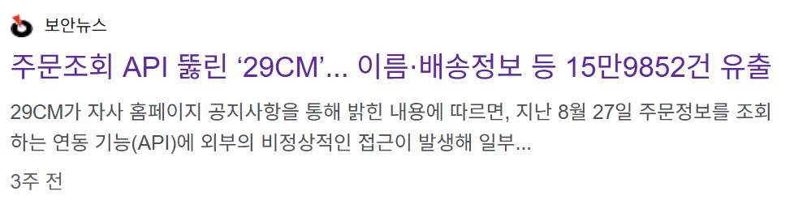
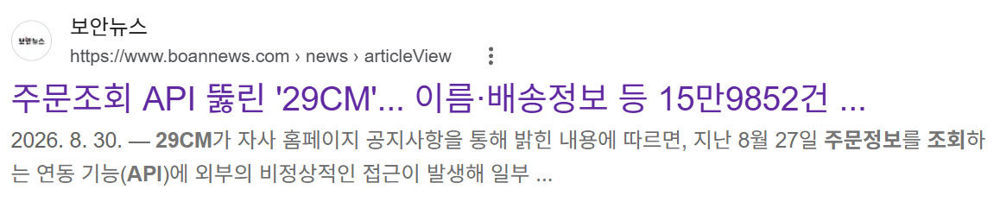

#### **2. 위버스, 결제 API 뚫려 42만건 정보 유출... "민감 정보는 무사"**
[위버스, 결제 API 뚫려 42만건 정보 유출... "민감 정보는 무사" - 보안뉴스](https://www.boannews.com/news/articleView.html?idxno=145683)

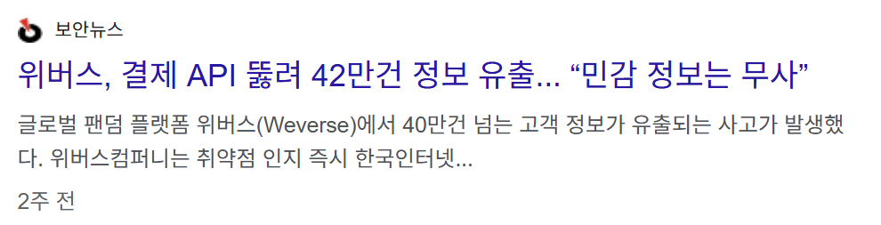
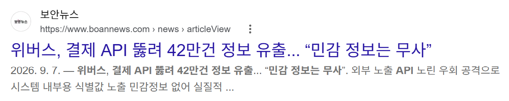

#### **3. 성형 사진부터 피부타입까지 털렸다... 강남언니·화해 고객 정보 유출**
[성형 사진부터 피부타입까지 털렸다... 강남언니·화해 고객 정보 유출 - 보안뉴스](https://www.boannews.com/news/articleView.html?idxno=145704)

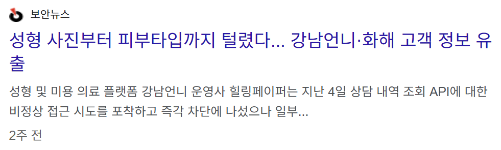
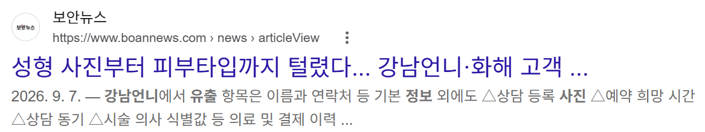

#### **4. 채용 플랫폼 레쥬메나인 개인정보 유출... 원인은 '서버 권한 검증 누락'**
[채용 플랫폼 레쥬메나인 개인정보 유출... 원인은 '서버 권한 검증 누락' - 보안뉴스](https://www.boannews.com/news/articleView.html?idxno=145832)

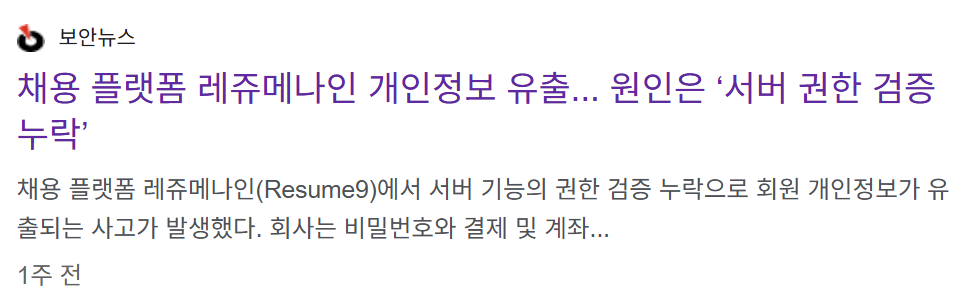
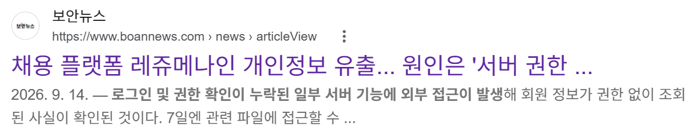

#### 5. **개인정보위 "API 통한 개인정보 유출 막아야"…사업자에 권한관리 당부**
[개인정보위 "API 통한 개인정보 유출 막아야"…사업자에 권한관리 당부](https://www.munhwa.com/article/11601272)

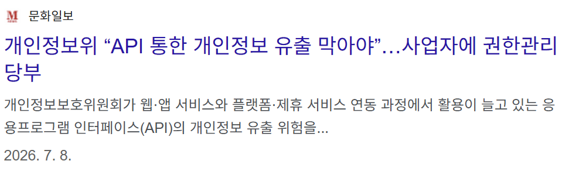
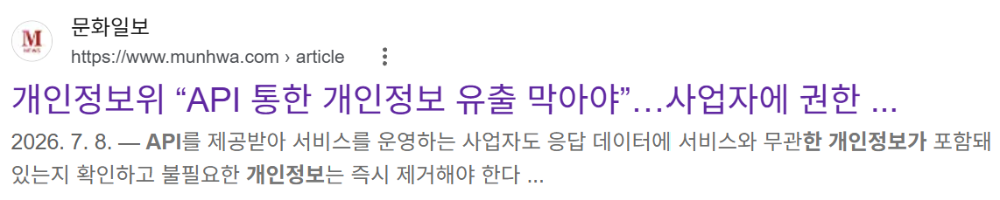

⇒ 해당 기사는 API로 인해 유출된 개인정보 규모랑 데이터…? 이런거가 명확히 있는 자료인거 같아요.

#### 해외 API로 인한 개인정보 유출 사건
[API Data Breaches 2026: How Exposed APIs Leaked Millions Of Records](https://www.cyberinfos.in/api-data-breaches-2026-leaked-millions/)

⇒ 이거는 API로 인한 개인정보 유출이 일어나는 원인을 분석한 기사인데, BOLA/BFLA 등이 나와있어요.

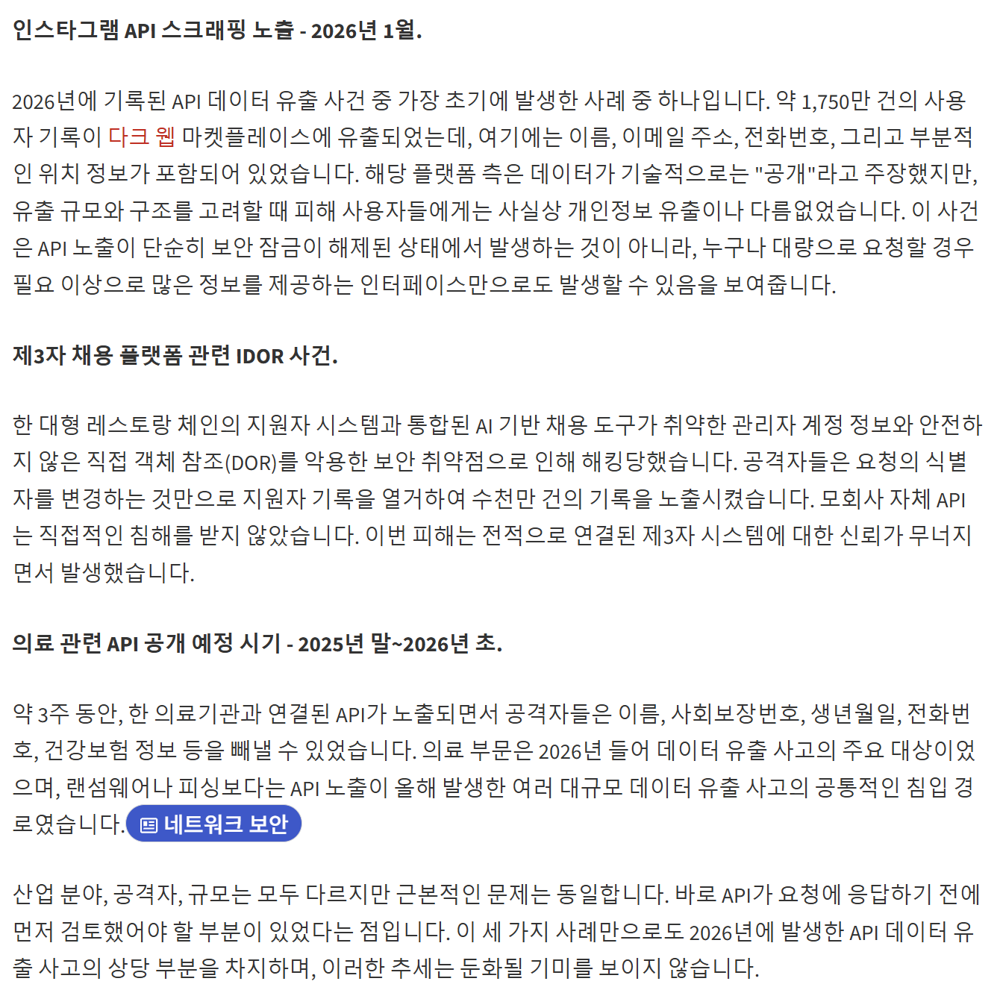
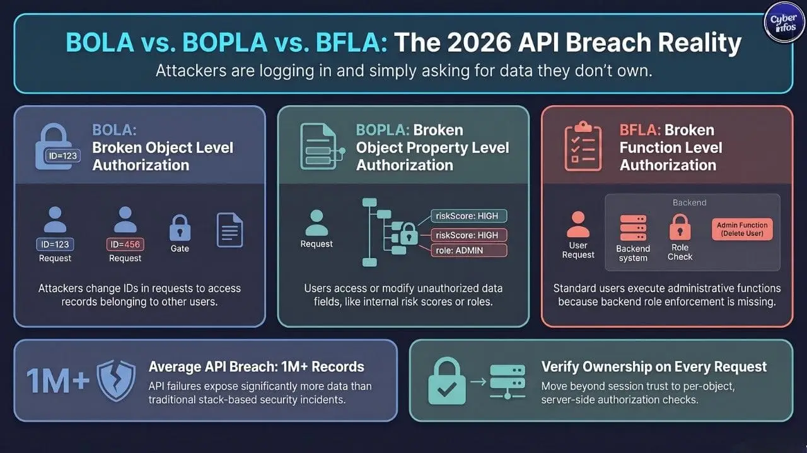
